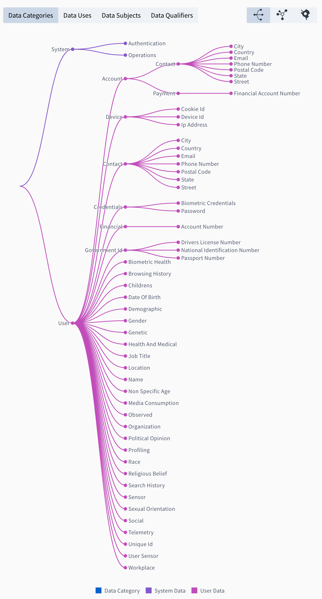

# Fideslang

 

## Overview

Fideslang or Fides Language is a privacy taxonomy and working draft of a proposed structure to describe data and data processing behaviors as part of a typical software development process. Our hope with standarizing this definition publicly with the community is to derive an interopable standard for describe types of data and how they're being used in applications to simplify global privacy regulations.

**To view the detailed taxonomy documentation, please visit [https://ethyca.github.io/fideslang/](https://ethyca.github.io/fideslang)**

## Summary of Taxonomy Classification Groups

The taxonomy currently comprises  of four classification groups that are used together to easily describe all of the data types and associated processing behaviors of an entire tech stack; both the application processes and any data storage.

[Click here to view an interactive visualization of the taxonomy](https://ethyca.github.io/fideslang/explorer/)

### 1. Data Categories

Data Categories are labels to describe the type of data processed by a system. You can assign one or more data categories to a field when classifying a system.

Data Categories are heirarchical with natural inheritance, meaning you can classify data coarsely with a high-level category (e.g. `user.provided` data), or you can classify it with greater precision using subclasses (e.g. `user.provided.identifiable.contact.email` data).

Learn more about [Data Categories in the taxonomy reference now](https://ethyca.github.io/fideslang/data_categories/).

### 2. Data Use Categories

Data Use Categories are labels that describe how, or for what purpose(s) a component of your system is using data. Similar to data categories, you can assign one or multiple Data Use Categories to a system.

Data Use Categories are also heirarchical with natural inheritance, meaning you can easily describe what you're using data for either coarsely (e.g. `provide.system.operations`) or with more precision using subclasses (e.g. `provide.system.operations.support.optimization`).

Learn more about [Data Use Categories in the taxonomy reference now](https://ethyca.github.io/fideslang/data_uses/).

### 3. Data Subject Categories

Data Subject is a label commonly used in the regulatory world to describe the users of a system who's data is being processed. In many systems a generic user label may be sufficient, however the Privacy Taxonomy is intended to provide greater control through specificity where needed. Examples of Data Subject include:

Examples of this are:

- `anonymous_user`
- `employee`
- `customer`
- `patient`
- `next_of_kin`

Learn more about [Data Subject Categories in the taxonomy reference now](https://ethyca.github.io/fideslang/data_subjects/).

### 4. Data Identification Qualifiers

Data Identification Qualifiers describe the degree of identification of the given data.
Think of this as a spectrum: on one end is completely anonymous data, i.e. it is impossible to identify an individual from it, and on the other end is data that specifically identifies an individual.

Along this spectrum are labels that describe the degree of identification that a given data might provide, such as:

- `identified_data`
- `anonymized_data`
- `aggregated_data`

Learn more about [Data Identification Qualifiers in the taxonomy reference now](https://ethyca.github.io/fideslang/data_qualifiers/).

### Extensibility & Interopability

The taxonomy is designed to support common privacy compliance regulations and standards out of the box, these include GDPR, CCPA, LGPD and ISO 19944.

You can extend the taxonomy to support your system needs. If you do this, we recommend extending from the existing class structures to ensure interopability inside and outside your organization.

If you have suggestions for missing classifications or concepts, please submit them for addition.
